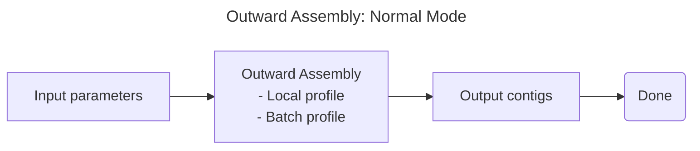
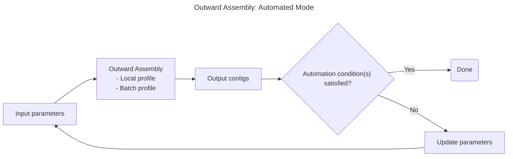

# Usage

There are two profiles for outward assembly:
* *Local*: Run outward assembly using your local machine.
* *Batch*: Run outward assembly using AWS Batch through Nextflow

There are two types of outward assembly modes:
* *Normal*: Run outward assembly once
* *Automated*: Run outward assembly multiple times, in a loop.

Below we will cover when and how to use the different modes and profiles. Here is a diagram to help visualize the different modes and profiles:





Table of Contents:
1. [Overview](#overview)
2. [Profiles](#profiles)
   - [Local profile](#local-profile)
   - [Batch profile](#batch-profile)
3. [Modes](#modes)
   - [Normal Mode](#normal-mode)
   - [Automated Mode](#automated-mode)
4. [Working directory structure](#working-directory-structure)
5. [Tips](#tips)

## Overview

The primary entrypoint to outward assembly is the Python function `outward_assembly` in `outward_assembly/pipeline.py`; a command line interface does not (yet) exist. See the docstring of `outward_assembly` for a detailed description of keyword parameters. The required parameters are:

* A path to the seed sequence(s) file (fasta) to assemble outward from;
* A list of s3 paths of reads to assemble. Reads must be in [SIZ format](./algorithm_details.md#input-data);
* Path for output contigs.

*Note: You are allowed to have multiple seed sequences in your fasta file.*

Using the `outward_assembly` function as described above would be considered running outward assembly in *normal* mode, whereas our *automated* mode builds abstractions on top of this function to allow for more complex workflows. Specifically, *automated* mode automates the labor-intensive iterative process of:

1. Running outward assembly;
2. Evaluating outputs;
3. Deciding whether to accept the outputs as final or modify parameters and re-run.

Outward assembly generates lots of intermediate results in its working directory; these are especially useful if you want to monitor the progress of an assembly in progress, retrieve results from intermediate iterations, or debug a crash. See the `outward_assembly` arguments `work_dir_parent` and `cleanup`.

## Profiles

### Local profile
The *local* profile utilizes the resources on your current machine.

#### Why use local profile?
Best suited for situations with a small number of reads.

#### Usage
Set `use_batch = false` in the outward_assembly parameters to trigger the *local* profile.

### Batch profile
The *batch* profile allows scaling to large numbers of reads by utilizing AWS Batch jobs.

#### Why use batch profile?
Ideal for scenarios where large datasets (potentially tens to hundreds of billions of reads) need processing, which is impractical on a single machine.

*For most users, we recommend using the local profile and just scaling up the number of compute resources that you're using (e.g. pick an EC2 instance with more cores and memory). We recommend that you do this and only use the batch profile if you find that the local profile is too slow.*

#### Usage
To run the outward assembly command, set `use_batch = true`, and specify your batch queue (`batch_queue`) and an s3 path to a work directory (`batch_workdir`).

## Modes

### Normal Mode
*Normal* mode is designed for users who want to run the outward assembly algorithm once. This would include a user who knows that specific samples contain reads that would assemble with their seed sequence. 

#### Usage

The usage of the *normal* mode in outward assembly requires that the user call the outward assembly function with the appropriate parameters. The only setup that the user needs to do is to generate a list of s3 paths to their reads.

To generate the required list of S3 paths for your input reads, you can use the helper function `s3_files_with_prefix` located in `outward_assembly/io_helpers.py`. This function takes an S3 bucket name and a prefix string, and returns a list of all object paths within that bucket matching the prefix.

Here's an example demonstrating how to use it to collect paths corresponding to multiple prefixes:

```python
# Example: List of prefixes identifying different sets of read files
prefixes = [
	"outward-assembly-test-data/siz/simulated-abcbd-reads_1",
	"outward-assembly-test-data/siz/simulated-abcbd-reads_2",
]
# Example: S3 bucket containing the read files
bucket = "nao-testing"

# Generate the list of full S3 paths for all files matching the prefixes
paths = [p for prefix in prefixes for p in s3_files_with_prefix(bucket, prefix)]
```

For example, providing the prefix `"outward-assembly-test-data/siz/simulated-abcbd-reads_1"` would retrieve all files in the `"nao-testing"` bucket that start with this string, potentially including:

```
s3://nao-testing/outward-assembly-test-data/siz/simulated-abcbd-reads_1_div0001.fastq.zst
s3://nao-testing/outward-assembly-test-data/siz/simulated-abcbd-reads_1_div0002.fastq.zst
s3://nao-testing/outward-assembly-test-data/siz/simulated-abcbd-reads_1_div0003.fastq.zst
```

*Note: The bucket name (`"nao-testing"`) and prefixes shown above are only examples. You must replace them with your actual S3 bucket name and the specific prefixes for your SIZ-formatted read files.*

We've provided an example script, `example_normal_assembly.py`, that demonstrates how to use outward assembly in *normal* mode with the *local* profile. To use this script, the user should do the following:

1. Create a copy of`example_normal_assembly.py` that can be modified.
2. Update the parameters in the script to your desired values, specifically:
    * `data_dir`: where the results will be stored locally.
    * `seed_path`: the path to the seed sequence(s) file (fasta format).
    * `bucket_name`: the name of the s3 bucket where the siz files are stored.
    * `prefixes`: the path(s) to the siz files on s3, using just the prefix(es) of the siz files.
3. Run the script.

By default, the example script enables adapter trimming using the file `./default_adapters.fasta` (it is *highly recommended* to use adapter trimming if your reads haven't been cleaned). To disable adapter trimming, simply remove the `adapters_path` parameter from the script.

The example script showcases a basic configuration for simplicity. The `outward_assembly` function accepts numerous other parameters for more fine-grained control. Some notable optional parameters include:

*   `warm_start_path`
*   `high_freq_kmers_path`
*   `read_subset_k`

For a comprehensive list of all available parameters and detailed explanations of their usage, please refer to the docstring within the `outward_assembly` function definition in `outward_assembly/pipeline.py`. Additionally, the [Algorithm Details](./algorithm_details.md) document provides context for parameters like `high_freq_kmers_path`.

### Automated mode

*Automated* mode is designed for users who need to run outward assembly iteratively. This would include a user who is unsure which samples contain reads that will successfully assemble with their seed sequence, and therefore would want to search through their data iteratively.

With *automated* mode, you can strategically begin with a subset of your data and progressively expand your search if initial assembly results are insufficient. The system intelligently adjusts parameters between iterations based on your defined strategy, optimizing both computational resources and discovery potential.

*Disclaimer: Automated mode does not support multiline sequences for FASTQ files. We plan on adding support for this in the future.*

#### Usage

The primary entrypoint to the *automated* outward assembly will be `automate_assembly.py` [^1]. This script takes in a yaml file as input, which specifies all of the parameters that will be used for running the pipeline.

[^1]: Right now, the `automate_assembly.py` script does not implement all the parameters of `outward_assembly`, however we plan on adding them in the futures. 

Generally, using this script will look like the following:
1. Prepare a list of datasets along with priorities for each of them.
   * We are currently working on creating a script that will automate this process
2. (Optional) Add your automation strategy to `outward_assembly/strategy.py`
   * The user may also decide to use this script without the automation turned on
   * We plan on making a default automation configuration in the future
3. Write your configuration in a yaml file.
4. Run `automate_assembly.py` and pass in your yaml file.

##### 1. Prepare a list of datasets along with priorities for each of them.
The YAML configuration file requires a list of S3 paths to datasets in ZST format, each with an assigned priority. 

This prioritization system allows you to begin with a smaller dataset subset and progressively include more data if initial assembly results are insufficient. When automation is enabled, the pipeline can automatically advance to datasets with the next priority level if the current assembly results don't meet the criteria defined in your strategy. Importantly, the pipeline will only look at the datasets within the current priority level, so if you want data in earlier priority levels to be considered, make sure to include them in the current priority level (in practice, this means that you will have the same data in multiple priority levels).

The input file should follow this CSV format:

```csv
s3_path,priority # Header
s3://random-test-data/here-is-some-data.fastq.zst,1 # Example row
```
##### 2. (Optional) Add your automation strategy to `outward_assembly/strategy.py`
Determining when to initiate another round of outward assembly can be challenging. While we plan to introduce a default automation configuration in the future, none currently exists. Users can create their own configurations by writing Python functions.

Users may utilize any of the variables outlined in `outward_assembly/strategy.py` to define conditions and actions for adjusting parameters between iterations. Once a strategy is created, users can reference the function name in their configuration file, allowing the pipeline to automatically import it.

An example strategy, `example_strategy`, is provided in `outward_assembly/strategy.py`.

*We are working to expand the number of conditions and actions available for automating outward assembly. In the future, we aim to include a default strategy for users who prefer not to create their own.*
##### 3. Write your configuration in a yaml file.
The YAML file is the primary configuration file for the outward assembly pipeline. It includes parameters for the assembly process, the automation strategy, and any compute restrictions. Below, all supported parameters are listed along with their defaults and whether they are optional.

```yaml
assembly:
  input_seed_path: <Path to seed sequence>
  input_dataset_list: <Path to dataset list from step 1>
  dataset_priority: <Dataset priority to start with> (default is 1)
  adapter_path: <Path to adapter sequence> (optional; default is None)
  work_dir: <Path to work directory>
  out_dir: <Path to output directory>
  output_filename: <Filename of output contigs>
  read_subset_k: <Kmer size for BBDuk> (default is 27)
  use_batch: <TRUE to use batch, False to use local> (default is FALSE)

decision: (optional)
  automate: <TRUE to use automation, FALSE to run outward assembly once> (default is FALSE)
  strategy: <Name of strategy to use> (required if automate is TRUE)
  limits: (optional)
    compute_time: <Max compute time in hours> (default is 5 hours)
    iterations: <Max iterations> (default is 20 iterations)
```

*Note: The `decision` parameter is optional. If not specified, the pipeline will run outward assembly once.*

##### 4. Run `automate_assembly.py` and pass in your yaml file.

The automation script can be run by executing the following command:

```bash
python automate_assembly.py --input_config <PATH TO YAML FILE>
```

## Working directory structure
```
.
├── current_contigs.fasta # working set of contigs. Used for read filtering when adapter trimming is disabled.
├── input_s3_paths.txt # list of input paths, copied for debugging
├── log.txt # collects some command output; not well structured
├── megahit_out_iter<i>-<j> # iteration i, subiteration j
│   ├── chose_this_subiter # empty file created if this subiter's contigs were chosen
│   ├── contigs_filtered.fasta # final.contigs.fa filtered via overlap graph logic
│   ├── final.contigs.fa # megahit output of this subiter's assembly
│   └── # other megahit outputs
├── original_seed.fasta # 
├── query_kmers.fasta # used for filtering all input reads, only appears if adapter trimming is enabled
├── reads # reads_* from each iter copied here for debugging
│   └── iter_<i> 
├── reads_1.fastq # reads used this iteration, will be copied to reads/
├── reads_2.fastq
├── reads_ff_1.fastq # _ff reads only appear if frequency filtering is enabled
├── reads_ff_2.fastq
├── reads_untrimmed_1.fastq # _untrimmed reads only appear if adapter trimming is eabled
├── reads_untrimmed_2.fastq
├── config.yaml # the configuration file used to run the pipeline
└── assembly_metrics.json # metrics related to the outward assembly run
```
Note that kmer counting logic occurs in a separate `kmers` directory which is created by `_high_frequency_kmers`.

The difference between running outward assembly in *normal* and *automated* mode is that the *automated* mode will create a new working directory each time it repeats.

## Analyzing results

This section provides guidance on analyzing the results generated by outward assembly.

### Relevant output files

Several output files provide valuable information for analyzing the results of an outward assembly run:

- **Assembly Metrics:** (`<work_dir>/<tmp_dir>/assembly_metrics.json`)
    *   A JSON file containing metadata and metrics about the assembly process.
    *   `inner_iteration_metrics` (list of dictionaries): Metrics recorded for each inner iteration.
        *   `read_pair_count` (int): The number of read pairs processed in the iteration. The exact meaning depends on the pipeline configuration:
            *   Default: Number of read pairs extracted by BBDuk.
            *   With adapter trimming: Number of read pairs remaining after adapter trimming.
            *   With frequency filtering: Number of read pairs remaining after frequency filtering.
        *   `iteration_number` (int): The index of the inner iteration.
        *   `contig_count` (int): The number of contigs generated in this iteration.
        *   `longest_contig` (int): The length of the longest contig generated in this iteration.
        *   `total_contig_length` (int): The sum of lengths of all contigs generated in this iteration.
    *   `final_read_pair_count` (int): The `read_pair_count` from the final inner iteration.
    *   `final_contig_count` (int): The `contig_count` from the final inner iteration.
    *   `final_contig_total_length` (int): The `total_contig_length` from the final inner iteration.

- **Output Contigs:** (`<work_dir>/final_output.fasta` or `<work_dir>/<tmp_dir>/final_output.fasta`)
    *   The final assembled sequences produced by the algorithm.
    *   Format: FASTA file. Each header line contains statistics generated by Megahit:
        *   Field 1: Contig ID
        *   Field 2: Megahit flag
        *   Field 3: Estimated coverage
        *   Field 4: Contig length

- **Filtered Reads:** (`<work_dir>/<tmp_dir>/reads_<1,2>.fastq`)
    *   The read pairs successfully filtered by BBDuk from the input data, used for the assembly process.

- **Intermediate Assemblies:** (`<work_dir>/<tmp_dir>/megahit_out_iter<i>-<j>/`)
    *   Directory containing output files from each Megahit sub-iteration (`<i>` is the outer iteration, `<j>` is the sub-iteration). Includes intermediate contig files (e.g., `final.contigs.fa`). Useful for debugging or analyzing assembly progression.

### Evaluating contig quality

Assessing the quality of the assembled contigs depends heavily on the specific research goals. However, the following analyses can be helpful in evaluating the results:

*   Perform a BLAST search with the final contig(s) against relevant databases.
*   Align the filtered reads (used in the assembly) back to the final contig(s).
*   Align the initial seed sequence back to the final contig(s).
*   Compare the final contig(s) with intermediate assemblies generated by Megahit during the process.

### Next steps

If the assembly results are not satisfactory, consider adjusting parameters or input data for subsequent runs. Based on empirical observations, increasing the amount of input data or decreasing the kmer size used by BBDuk often helps improve results when assembly fails or produces short contigs.

Here are some common scenarios and potential solutions:

#### Issue: Seed fails to assemble or contig is too short
*   **Verify seed quality:** Ensure the chosen seed sequence is accurate and error-free, as explained in the [Choosing a good seed](#choosing-a-good-seed) section. 
*   **Increase input data:** The target genome corresponding to the seed might not be sufficiently represented in the current dataset. Try adding more sequencing data.
*   **Decrease BBDuk kmer size:** If the seed potentially contains sequencing errors relative to the target genome, a smaller kmer size might allow BBDuk to identify relevant reads by matching shorter, error-free segments.

#### Issue: Contigs are unexpectedly long

*   **Increase BBDuk kmer size:** If the initial kmer size is too small, BBDuk might select reads based on kmers that are not specific enough to the target genome, leading to off-target assembly. Increasing the kmer size reduces the likelihood of off-target assembly.

#### Issue: Uncertainty about contig correctness
*   **Increase input data:** Assembling with more data can increase confidence in the results by providing stronger evidence for the assembled sequence.
*   **Adjust BBDuk kmer size:** Experiment with different kmer size values (both increasing and decreasing) as described above to see how it impacts the resulting contigs.
*   **Perform downstream validation:** Use the analyses suggested in the [Evaluating contig quality](#evaluating-contig-quality) section (e.g., BLAST, read alignment) to further assess the contigs.

## Tips
### Choosing a good seed
The seed serves two purposes in outward assembly:
1. It's the initial contig, i.e. we use kmers from the seed to filter reads in the first iteration.
2. It's used to filter contigs at the end of each iteration.

At present, there's no error tolerance  in the latter filtering step: contigs must contain your seed exactly (up to reverse complementing). Therefore your seed really must be error-free. If your seed has an error (relative to the likely genome that generated the reads you're interested in), then the following sad sequence occurs:
1. Outward assemble uses the seed to find read pairs containing seed kmers.
2. These read pairs are assembled in the first iteration.
3. No contig output in the first iteration exactly contains the seed.
4. Therefore, the algorithm did not progress in the first iteration and terminates early.

Ideally, your seed is the minimal sequence such that you're interested in a contig if and only if the contig contains the seed. In practice, 25-50bp seems to work well. If you're trying to accelerate the outward assembly pipeline by providing a longer sequence with more kmers, use the `warm_start_path` argument rather than elongating your seed.
